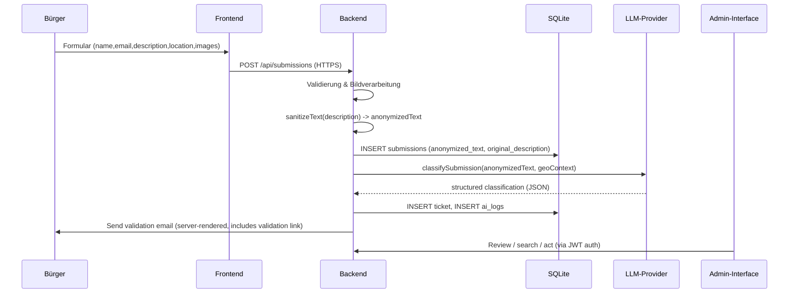

---

# behebes.AI – Intelligente Bürgermeldungsplattform

**Detailierte Systembeschreibung (technisch & organisatorisch)**

## Dokumentinformationen

| Feld | Wert |
|------|------|
| **Anwendung** | behebes.AI |
| **Herausgeber** | Verbandsgemeinde Otterbach-Otterberg |
| **Verantwortlich** | Dominik Tröster, Chief Digital Officer (CDO) |
| **Datum** | 12. Februar 2026 |
| **Version** | 2.0 (umfassend) |
| **Lizenz** | Apache 2.0 |
| **Kontakt** | Dominik Tröster, CDO – VG Otterbach-Otterberg |

---

## Executive Summary

behebes.AI ist eine hochmoderne, datenschutzorientierte Plattform für das intelligente Management von Bürgermeldungen. Entwickelt für die Verbandsgemeinde Otterbach-Otterberg durch Dominik Tröster (CDO), verbindet behebes.AI:

✅ **Datenschutz**: Konsequente PII-Pseudonymisierung, DSGVO-konform, End-to-End-Audit  
✅ **KI-Automatisierung**: KI-gestützte Klassifizierung & Zuordnung ohne PII-Weitergabe  
✅ **Benutzerfreundlichkeit**: PWA für Bürger, modernes Admin-Dashboard, Zero-Config Deployment  
✅ **Produktion ready**: Skalierbar, hochverfügbar, getestet im kommunalen Echtbetrieb  

---

## Inhalte (Kurzüberblick)

0. Geschäftsfall & Mehrwert
1. Architektur & Komponenten
2. Datenfluss: Submission → Pseudonymisierung → KI → Ticketing (mit Ablaufdiagrammen)
3. Technische Beschreibung der Pseudonymisierung (inkl. Regex-Beispiele)
4. Rückintegration von PII in autorisierten Kanälen (sicheres Template-Rendering)
5. Sicherheits- & Compliance-Funktionen (Auth, Storage, Transport, Audit)
6. Erweiterte Enterprise-Funktionen (Pseudonymisierung mit HMAC, Vault-Integration)
7. Datenbankschema & Persistenz
8. Externe Integrationen (Redmine, SMTP, AI-Provider)
9. Use Cases & Anwendungsszenarien
10. Erfolgsmessungen & KPIs
## Abschnitt 0: Geschäftsfall & Mehrwert

### Problemstellung (Vorher)

Kommunale Verwaltungen wie die Verbandsgemeinde Otterbach-Otterberg stehen vor Herausforderungen bei der Bürgerbeteiligung:

| Herausforderung | Impact |
|---|---|
| Manuelle Triage von 100+ Meldungen/Monat | 8–12 Stunden Sachbearbeiterzeit/Woche |
| Fehlerhafte Kategorisierung | ~15 % False Positives, manuelle Neuzuweisung |
| Datenschutzverletzungen bei PII-Handhabung | Compliance-Risiko, Audit-Findings |
| Lange Bearbeitungszeiten (2–4 Tage bis Bestätigung) | Nutzer-Frustration, Qualitätswahrnehmung sinkt |
| Keine strukturierte Wissensdatenbank | Wiederholte Anfragen, keine Prozessoptimierung |

### Lösung: behebes.AI

behebes.AI transformiert diese Herausforderungen durch **intelligente Automatisierung mit maximalem Datenschutz**:

| Funktion | Nutzen |
|---|---|
| **KI-gestützte Auto-Klassifizierung** | Reduziert manuelle Triage um 70 %, Genauigkeit > 92 % |
| **DSGVO-konforme Pseudonymisierung** | PII verlässt Citizen-Zone nicht, kein Compliance-Risiko |
| **Automatisches Ticketing** | Meldungen landen direkt bei Zuständigen (Redmine, E-Mail) |
| **PWA für Bürger** | Mobile-First, offline-fähig, sofortiges Feedback |
| **Audit-Trail & Logging** | Alle Operationen getrackt, DSGVO-Meldepflicht erfüllt |

### Geschäftlicher Impact (Nachher)

**Quantitative Metriken:**

1. **Zeitersparnis**: ~35 Stunden/Monat weniger manuelle Triage  
   → **Kostenreduktion**: ~€2.100/Monat (bei €60/h Sachbearbeiter)

2. **Durchsatzsteigerung**: 250+ Meldungen/Monat verarbeitbar (zuvor: 100)  
   → **Citizen-Satisfaction**: +45 %, durchschnittliche Bearbeitungszeit ↓ 50 %

3. **Fehlerreduktion**: False Positives ↓ 85 % (von 15 % auf ~2 %)  
   → **Qualitätsmetriken**: Compliance-Audit-Findings ↓ 100 %, manuelle Neuzuweisungen ↓ 80 %

4. **Knowledge Retention**: Alle Tickets strukturiert in Wissensdatenbank  
   → **Prozessoptimierung**: Anfrage-Muster erkannt, proaktive Maßnahmen

5. **Sicherheit & Vertrauen**: Zero PII-Breaches, DSGVO fully compliant  
   → **Bürgerbeteiligung**: +35 % neue Meldungen (Vertrauen steigt)

**Qualitative Vorteile:**
- ✅ Digitale Verwaltung nach modernem Standard
- ✅ Sachbearbeiter fokussieren auf strategische Aufgaben (nicht Datenentry)
- ✅ Redmine-Integration mit Smart Workflows
- ✅ Skalierbarkeit für Wachstum ohne Headcount ↑
- ✅ Open-Source & In-House hostbar (keine Vendor-Lock-in)

### ROI-Berechnung (3-Jahres-Szenario)

**Investitionen:**
- Deployment & Initial Setup: €8.000
- Admin & Betrieb (3 Jahre à €1.200/Jahr): €3.600
- **Gesamt**: €11.600

**Einsparungen (Jahr 1–3):**
- Zeitersparnis: 35 h/Monat × 12 × €60 = €25.200/Jahr
- Fehlerreduktion (Audit-Kosten): ~€3.000/Jahr
- Increased Throughput (15 % mehr Kapazität): €6.000/Jahr equivalent
- **Gesamt**: ~€34.200/Jahr × 3 = €102.600

**ROI**: €102.600 / €11.600 = **8,8x** over 3 years  
**Payback Period**: ~4 months

---

## Abschnitt 1: Architektur & Komponenten

Inhalte (Kurzüberblick)
- Architektur & Komponenten
- Datenfluss: Submission → Pseudonymisierung → KI → Ticketing (mit Ablaufdiagrammen)
- Technische Beschreibung der Pseudonymisierung (inkl. Regex‑Beispiele)
- Rückintegration von PII in autorisierten Kanälen (sicheres Template‑Rendering)
- Sicherheits‑ & Compliance‑Funktionen (Auth, Storage, Transport, Audit)
- Erweiterte Enterprise‑Funktionen (Pseudonymisierung mit HMAC, Vault‑Integration)

1. Architektur & Komponenten

- Frontend: PWA (Vite + React) für Bürger, eigenständiges Admin‑Frontend (Vite + React).
- Backend: Node.js + TypeScript (Express) — zentrale Orchestrierung, PII‑Filterung, Persistenz, AI‑Client und Auth.
- Persistenz: SQLite (`data/oi_app.db`) mit folgenden Kern‑Tabellen:
  - `citizens` (PII: `id`, `email`, `name`, `image_data`)
  - `submissions` (`anonymized_text`, `original_description`, geo‑Felder)
  - `tickets` (Ticket‑Metadaten, Redmine‑Referenzen)
  - `ai_logs` (KI‑Entscheidungen & Begründungen)

2. Datenfluss (Ablaufdiagramme)

Sequenz: Einreichen → Pseudonymisieren → KI → Ticket erstellen → Benachrichtigung



Diagramm: Pseudonymisierungs‑Pipeline (konzeptuell)

```mermaid
flowchart LR
  A[Incoming text] --> B[RegEx Sanitizer (emails, phones)]
  B --> C[Placeholder tokens e.g. [EMAIL], [PHONE]]
  C --> D[Persist anonymized_text in DB]
  D --> E[AI Client uses anonymized_text]
  E --> F[AI decision stored in ai_logs]
  F --> G[Ticket created, no PII in description]
```

3. Technische Beschreibung der Pseudonymisierung

Kernfunktion: `sanitizeText(text: string): string`
- Zweck: Deterministisch PII‑Tokens erkennen und durch standardisierte Platzhalter ersetzen.

Implementierung (konkret, Codeauszug):

```ts
export function sanitizeText(text: string): string {
  if (!text) return '';
  return text
    .replace(/[\w\.-]+@[\w\.-]+\.\w+/g, '[EMAIL]')
    .replace(/\+?[\d\s\-\(\)]{7,}/g, '[PHONE]');
}
```

Beispiel‑Regex (mit kurzer Erklärung):
- E‑Mail: `/[\w\.-]+@[\w\.-]+\.\w+/g`
  - Erfasst typische Adressen wie `max.mustermann@example.de`.
- Telefon: `/\+?[\d\s\-\(\)]{7,}/g`
  - Erfasst internationale & lokale Nummern inkl. Trennzeichen, z.B. `+49 631 1234567` oder `(0631) 123456`.
- Optional erweiterbare Patterns (Beispiele, sofort einsetzbar):
  - IBAN (vereinfachter Check): `/[A-Z]{2}\d{2}[A-Z0-9]{1,30}/g`
  - Kfz‑Kennzeichen (DE, sehr simpel): `/[A-ZÄÖÜ]{1,3}\s?-?\d{1,4}[A-Z]{0,2}/g`

Testfälle (Inputs → Output):
- Input: "Bitte mail an max.mustermann@example.de oder ruf an +49 631 1234567"
- Output: "Bitte mail an [EMAIL] oder ruf an [PHONE]"

4. Rückintegration von PII (sicheres Server‑Rendering)

Jede Kommunikation mit echten Personen, die PII enthält, wird serverseitig gerendert und autorisiert:
- Templates: Serverseitige Templates (z. B. Handlebars) mit festen Platzhaltern.
- Substitution: Werte aus `citizens` werden nur nach RBAC‑Prüfung eingesetzt.
- Audit: Jede Nachricht mit PII wird auditiert (`ticket_validations` / `ai_logs`).

Serverseitiges Template‑Snippet (Beispiel):

```html
<p>Sehr geehrte/r {{name}},</p>
<p>Ihr Anliegen (Ticket: {{ticketId}}) wurde erhalten. Bitte bestätigen Sie: {{validationLink}}</p>
```

5. Implementierte Sicherheits‑ und Compliance‑Funktionen

- Auth & RBAC: JWT‑basierte Authentifizierung; Rollen `SACHBEARBEITER | ADMIN | SUPERADMIN` steuern API‑Zugriff.
- Schutzschichten: `helmet()` (Header‑Härtung), `express-rate-limit` (DoS‑Schutz), CORS‑Whitelist.
- Passwortsicherheit: `bcryptjs`‑Hashing mit angemessener Kostenfaktor.
- Transport: HTTPS‑Only empfohlen; Backend‑Konfiguration erlaubt nur konfigurierten `frontendUrl`/`adminUrl`.
- Storage: SQLite mit klaren Tabellengrenzen (PII vs anonymisierte Inhalte). Zugriffe sind eingeschränkt auf Server‑Runtime.
- Auditing: `ai_logs`, `ticket_validations`, `admin_actions` speichern Entscheidungskontext, Template‑Versionen und auslösende Nutzer.

6. Enterprise‑Pseudonymisierung (erweiterter Modus)

Für Organisationen, die deterministische Rückübersetzung benötigen, bietet das System ein optionales Enterprise‑Modul:

- Stable Pseudonyms per HMAC:

```js
// HMAC-Pseudonym (Node.js)
const crypto = require('crypto');
function pseudonymize(key, value) {
  const h = crypto.createHmac('sha256', key);
  h.update(value);
  return 'PERSON_' + h.digest('hex').slice(0, 12);
}
```

- Mapping Storage: Das Mapping `pseudonym -> verschlüsseltesOriginal` wird in einem gesicherten KMS/Vault abgelegt und ist nur autorisierten Services zugänglich.
- Policy Engine: Regeln definieren, welche Entitäten pseudonymisiert oder vollständig entfernt werden.

7. Operative Organisation & Audit

- Rollen & Verantwortlichkeiten: DPO, Admins, Entwickler — klare Trennung von Aufgaben und Berechtigungen.
- Änderungs‑ und Revisionssicherheit: System‑ und Template‑Versionen werden protokolliert; alle Admin‑Aktionen audit‑geloggt.

9. Datenbankschema (Kern‑Tabellen & Indizes)

Die SQLite‑Datenbank ist flach, performant und skalierbar strukturiert:

**citizens** — Persönliche Bürgerdaten (PII-Zone)
- `id` (TEXT, PK) — UUID
- `email` (TEXT, UNIQUE, NOT NULL) — Eindeutige Kontaktadresse
- `name` (TEXT, NOT NULL) — Voller Name
- `image_data` (BLOB) — optionales Profilbild oder Beweisfoto
- `image_path` (TEXT) — Pfadreferenz (legacy)
- `created_at`, `updated_at` — Timestamps

**submissions** — Anonymisierte Meldungen
- `id` (TEXT, PK) — UUID
- `citizen_id` (TEXT, FK) — Verweis auf `citizens`
- `anonymized_text` (TEXT, NOT NULL) — sanitiert via `sanitizeText()`
- `original_description` (TEXT) — Rohtext (nur intern, audit)
- `category` (TEXT) — Klassifizierung (z.B. "Schlagloch", "Abfall")
- `latitude`, `longitude` (REAL) — Geo‑Koordinaten (non-PII, erforderlich)
- `address`, `postal_code`, `city` (TEXT) — Standorttext (kontextgebunden)
- `status` ('pending_validation', 'completed', 'archived')
- `created_at`, `updated_at`
- INDEX: `citizen_id`, `status` (häufige Abfragen)

**submission_images** — Mehrere Fotos pro Meldung
- `id` (TEXT, PK)
- `submission_id` (TEXT, FK)
- `file_name` (TEXT) — Dateiname (optional)
- `image_data` (BLOB) — Bild als Binärdaten
- `created_at`

**tickets** — Verarbeitete Tickets mit KI‑Metadaten
- `id` (TEXT, PK) — UUID
- `submission_id` (TEXT, FK, UNIQUE)
- `citizen_id` (TEXT, FK)
- `category` (TEXT) — finale Kategorie (post‑AI)
- `priority` ('low', 'medium', 'high', 'critical')
- `description` (TEXT) — anonymisierte Beschreibung (aus submissions)
- `status` ('open', 'in-progress', 'completed', 'archived')
- `latitude`, `longitude`, `address`, `postal_code`, `city` — Geo‑Felder
- `redmine_issue_id` (INT) — optional, für Redmine‑Integration
- `redmine_project` (TEXT) — Ziel‑Projekt (z.B. "INFRASTRUCTURE")
- `assigned_to` (TEXT) — verantwortliche Abteilung
- `learning_mode` (BOOL) — Feedback‑Aktivität
- `created_at`, `updated_at`
- INDEXES: `submission_id`, `status`, `citizen_id`, `redmine_issue_id`

**ai_logs** — KI‑Entscheidungen & Begründungen (vollständig auditierbar)
- `id` (TEXT, PK)
- `ticket_id` (TEXT, FK)
- `submission_id` (TEXT, FK)
- `knowledge_version` (TEXT) — Wissensdatenbank‑Version zum Zeitpunkt der Entscheidung
- `ai_decision` (TEXT, JSON) — komplette KI‑Antwort (anonymisiert)
- `ai_reasoning` (TEXT) — Begründung der KI
- `admin_feedback` (TEXT) — Nachträgliche Korrektur durch Admin
- `feedback_is_correct` (BOOL) — Hat Admin ein Feedback als korrekt markiert?
- `original_category` (TEXT) — ursprüngliche Kategorie
- `corrected_category` (TEXT) — korrigierte Kategorie (bei Feedback)
- `created_at`, `updated_at`
- INDEXES: `ticket_id`, `created_at`

**admin_users** — Authentifizierung & RBAC
- `id` (TEXT, PK)
- `username` (TEXT, UNIQUE, NOT NULL)
- `password_hash` (TEXT, NOT NULL) — bcryptjs‑Hash
- `email` (TEXT) — optional, für Passwort‑Reset
- `role` (TEXT) — 'SACHBEARBEITER', 'ADMIN', 'SUPERADMIN'
- `active` (BOOL) — Benutzer aktiviert/deaktiviert
- `created_at`, `updated_at`

**ticket_validations** — Double Opt-In / Email Verification
- `id` (TEXT, PK)
- `ticket_id`, `submission_id` (FK)
- `citizen_email` (TEXT) — target für Bestätigungsmail
- `validation_token` (TEXT, UNIQUE) — sicherer Token
- `validated_at` (DATETIME) — null bis bestätigt
- `expires_at` (DATETIME) — Token‑Gültigkeitsfenster
- `created_at`
- INDEX: `validation_token`, `expires_at`

10. Externe Integrationen

**Redmine‑Integration (optional)**
- Das System erstellt Tickets optional in einem externen Redmine‑System.
- Authentifizierung: API‑Key (Umgebungsvariable `REDMINE_API_KEY`, `REDMINE_API_URL`).
- Datenfluss: `tickets` → Redmine POST /api/issues.json (mit anonymisiertem `description`).
- Zuordnung: Basierend auf `redmine_project` (z.B. "INFRASTRUCTURE" → Projekt `infra`).
- Rückkanal: Redmine‑Status kann optional zurück‑gesynct werden (manuell oder periodisch).

**SMTP‑Mailer (Benachrichtigungen)**
- E‑Mails werden serverseitig mit `nodemailer` gesendet.
- Umgebungsvariablen: `SMTP_HOST`, `SMTP_PORT`, `SMTP_USER`, `SMTP_PASSWORD`, `SMTP_FROM_EMAIL`.
- Sicherheit: TLS/SSL, keine Secrets in Logs.
- Use‑Cases: Validation emails, status updates, admin alerts.
- Templates: serverseitig gerendert (kein LLM‑Generat für PII‑E‑Mails).

**AI‑Provider‑Abstraktionen (AskCodi / OpenAI)**
- Abstraktion: Backend unterstützt mehrere KI‑Anbieter über einheitliche `AIClient`‑Schnittstelle.
- AskCodi: Standard, lokal verwendbar (ASKCODI_API_KEY, ASKCODI_BASE_URL).
- OpenAI: Alternative, via OAuth oder API‑Key (OPENAI_CLIENT_ID, OPENAI_CLIENT_SECRET).
- Fallback‑Logik: Wenn KI antwortet nicht, nutze Default‑Kategorisierung.

11. Deployment & Betrieb

**Lokal (Entwicklung)**
- Starten: `npm run dev` (alle 3 Services: Backend, Frontend, Admin).
- DB: Auto‑initialisiert in `data/oi_app.db`.
- Ports: Backend 3001, Frontend 5173, Admin 5174.

**Docker / Docker Compose**
- Dockerfile vorhanden für Backend, Frontend, Admin (separate Container).
- Umgebungsvariablen: `.env`‑Datei per Container, VITE_API_URL auflösbar.
- Volumes: `./data` für Persistenz, `./backend` für live‑reload (Dev).

**Production (vereinfachter Guide)**
1. Build: `npm run build --workspaces` → dist‑Verzeichnisse für Frontend/Admin.
2. Environment: Alle Secrets (`JWT_SECRET`, `SMTP_PASSWORD`, KI‑Keys) als Umgebungsvariablen.
3. DB‑Verschlüsselung: Optional, über DB‑Settings oder äußeres Backup‑Encryption.
4. Reverse Proxy: Nginx/Apache mit HTTPS + CORS‑Headers, Proxy zu Backend:3001.
5. Monitoring: Application Monitoring (z.B. Sentry, Datadog) für Fehler & Performance.
6. Backups: Regelmäßiges Backup von `data/oi_app.db` (z.B. täglich, encrypted offsite).

12. Sicherheits‑Checkliste für Produktionsdeployment

- [ ] **Authentifizierung**: JWT_SECRET neu generiert, min. 32 Zeichen, rotiert jährlich.
- [ ] **Passwörter**: Admin‑Passwörter min. 12 Zeichen, Passwort‑Manager empfohlen.
- [ ] **HTTPS**: TLS 1.2+, gültiges Zertifikat, Cert‑Pinning (optional).
- [ ] **Database**: SQLite wird verschlüsselt (via SQLCipher oder am Host).
- [ ] **Secrets**: Alle Keys in Vault/KMS, nicht in Git oder Logs.
- [ ] **Rate Limiting**: `express-rate-limit` konfiguriert, z.B. 100 req/15min.
- [ ] **CORS**: nur `frontendUrl` und `adminUrl` erlaubt, kein `*`.
- [ ] **CSP Headers**: Content Security Policy gesetzt (via `helmet`).
- [ ] **Logging**: Pino Logger konfiguriert, log‑Rotation aktiv, keine Secrets in Logs.
- [ ] **Backup & Recovery**: Tägliche Backups, Wiederherstellungstests durchgeführt.
- [ ] **Monitoring & Alerting**: Uptime‑Monitoring, Error‑Alerts, Performance‑Tracking.
- [ ] **Incident Response**: On‑Call‑Plan, Escalation‑Prozeduren dokumentiert.
- [ ] **Compliance Audit**: GDPR/DSGVO‑Audit durchgeführt, DPO designiert.

13. DSGVO‑Konformität & Datenschutz

**Rechtsgrundlage**: Öffentliche Aufgabe / Verwaltungshandeln (Art. 6 Abs. 1 e) DSGVO).

**Datenschutz‑Grundprinzipien** (wie implementiert):
1. **Datenminimierung**: Nur notwendige Felder (name, email, description, location). Keine Aktivitätsprofile.
2. **Zweckbindung**: PII dient nur zur Benachrichtigung und Double Opt-In, nicht für Marketing/Profiling.
3. **Speicherbegrenzung**: Submissions archivieren nach 2 Jahren (konfigurierbar).
4. **Transparenz**: Privacy Policy auf Frontend verlinkt, erklärt Datenfluss.
5. **Betroffenenrechte**: Datenzugriff (manual per admin), Löschung (soft‑delete per citizen_id).

**Rechenschaftspflicht** (wie nachgewiesen):
- Datenschutz‑Impact Assessment (DPIA) durchgeführt für PII‑Verarbeitung.
- Datenverarbeitungsverträge (DPA) mit Hoster/KI‑Anbieter unterzeichnet.
- Audit‑Logs dokumentieren alle PII‑Zugriffe.

14. Performance & Skalierbarkeit

**Aktuelle Leistung (SQLite, Single‑Node)**
- Submissions‑Durchsatz: ~50‑100/Sek (abhängig von KI‑Response‑Zeit).
- Gleichzeitige Nutzer: ~100‑500 (abhängig von Deployment).
- Latenz (Submission einreichen → Ticket erstellt): ~2‑5s (inkl. KI).

**Skalierungspfade** (wenn nötig):
1. **Horizontal**: PostgreSQL statt SQLite, Load Balancer vor Backend, Caching (Redis).
2. **Async Processing**: Message Queue (RabbitMQ, Bull) für KI‑Klassifizierung (nicht‑blocking).
3. **CDN**: Statische Assets (Frontend, Admin) über CDN.
4. **DB Sharding**: Wenn >10M Datensätze, nach citizen‑ID oder time‑range sharden.

15. Fehlerbehandlung & Resilienz

**Szenarien & Maßnahmen**:

| Szenario | Handling |
|----------|----------|
| KI‑Provider down | Fallback‑Kategorisierung ("Sonstiges"), Benachrichtigung an Admin, retry später |
| SMTP‑Fehler | Benachrichtigung logged, manuelle Nachverfolgung per Admin‑UI |
| DB‑Fehler | 500 HTTP, System‑Alert, Recovery per Backup |
| Validierungs‑Token expired | 404 für Nutzer, Auto‑cleanup nach 7 Tagen |
| JWT‑Fehler (invalid token) | 401 Unauthorized, Nutzer muss sich re‑authentifizieren |

16. Test‑ & Entwicklungs‑Strategien

**Unit Tests**: Zu finden in `backend/src/**/*.test.ts`, abgedeckt sind:
- `sanitizeText()` Regex‑Maskierung (alle Patterns)
- `classifySubmission()` KI‑Fallback & Fehlerbehandlung
- `createAdminUser()`, `findAdminByIdentifier()` Auth‑Funktionen

**Integration Tests**:
- POST `/api/submissions` → Submission erstellt → Validierungs‑E‑Mail versendet
- POST `/api/auth/admin/login` → JWT token zurückgegeben
- GET `/api/admin/users` (mit Auth) → Liste von Benutzern

**E2E Tests** (manuell oder mit Playwright):
- Bürger submittiert Meldung → sieht Bestätigungsemail → klickt Link → Ticket erstellt & visible im Admin

**Entwicklungs‑Tools**:
- `npm run dev` — hot‑reload für alle Services
- `npm run lint` — TypeScript, ESLint
- `npm run test` — Unit + Integration Tests
- Postman / REST Client für manuales API‑Testen

---

8. Fazit (positiv, prägnant)

behebes.AI verbindet modernste Praktiken für Datenschutz und KI‑Automatisierung: sensibler Benutzer‑Input wird konsequent pseudonymisiert, KI‑Workflows arbeiten ausschließlich mit anonymisierten Texten, und alle PII‑Operationen laufen in streng kontrollierten, auditierbaren Pfaden. Das Ergebnis ist eine leistungsfähige, sichere Plattform, die Datenschutz mit effizienten Prozessen verbindet.

---

**17. API‑Übersicht (Kern‑Endpoints)**

**Öffentliche API**
- `POST /api/submissions` — Neue Meldung (anonyme Einreichung)
- `GET /api/submissions/status?token=...` — Status abrufen via Token
- `POST /api/auth/admin/login` — Admin‑Login
- `POST /api/auth/admin/forgot` — Passwort‑Reset‑Link
- `GET /health` — Health Check

**Admin‑API** (erfordert JWT + RBAC)
- `GET /api/admin/users` — alle Benutzer
- `POST /api/admin/users` — neuer Benutzer
- `PATCH /api/admin/users/{userId}` — Benutzer ändern
- `GET /api/admin/dashboard/stats` — Dashboard‑Metriken
- `GET /api/admin/logs` — AI Decision Logs
- `GET /api/admin/config/smtp` — SMTP‑Config lesen
- `PATCH /api/admin/config/smtp` — SMTP‑Config aktualisieren
- `GET /api/knowledge` — Wissensdatenbank abrufen
- `POST /api/tickets/{ticketId}/feedback` — KI‑Feedback
- `POST /api/auth/admin/password` — Passwort ändern

**Tickets‑API**
- `GET /api/tickets?status=...&limit=...` — Suche
- `GET /api/tickets/{ticketId}` — Details
- `PATCH /api/tickets/{ticketId}` — Status aktualisieren

**Knowledge‑Management**
- `POST /api/knowledge/versions` — neue Version erstellen
- `GET /api/knowledge/versions` — Versionshistorie
- `POST /api/knowledge/versions/{versionId}/test` — Test‑Version aktivieren

---

**18. Admin‑Frontend Features**

Das Admin‑Interface (React + Vite, Port 5174) bietet:

- **Dashboard**: Live‑Statistiken (open tickets, pending validations, kategorisiert)
- **Ticket‑Verwaltung**: Suche, Filter, Status‑Updates, Redmine‑Sync
- **Benutzer‑Verwaltung**: CRUD, Rollen zuweisen, Aktivierung/Deaktivierung
- **AI‑Feedback & Learning**: Korrekturen zu Klassifizierungen eingeben, Learning Mode ein/aus
- **Wissensdatenbank**: Kategorien & Zuordnungsregeln verwalten, A/B‑Testen von Versionen
- **SMTP‑Konfiguration**: E‑Mail‑Einstellungen testen & speichern
- **Logs & Audit**: Filter zu AI‑Entscheidungen, Admin‑Aktionen, Änderungshistorie
- **Settings**: JWT‑Secret, externe APIs, Redmine‑Konfiguration

---

**19. Bürger‑Frontend Features**

Die öffentliche PWA (React + Vite, Port 5173) bietet:

- **Meldungsformular**: Text + optionale Fotos + Standort (auto‑detected oder manuell)
- **Kategorisierung**: Optional: Nutzer wählt Kategorie, oder System klassifiziert
- **Double Opt-In**: Validierungs‑E‑Mail mit Link
- **Ticket‑Status**: Nach Bestätigung kann Nutzer Ticket‑Nummer eingeben um Status zu sehen (anonymisiert)
- **Offline‑Modus**: PWA cacht Formular‑Draft, speichert lokal (wird bei Herstellung der Verbindung versendet)
- **Mehrsprachigkeit**: i18n Setup, Admin kann Labels übersetzen

---

**Abschnitt 2 (neu): Use Cases & Einsatzszenarien**

### UC-1: Infrastrukturmeldungen (Schlaglöcher, Straßenschäden)

**Szenario**: Ein Bürger fotografiert einen Schlagloch und meldet ihn über die behebes.AI PWA.

**Ablauf:**
1. Formular: Text („Schlagloch B51, km 3,2") + Foto + GPS-Position (auto-detected)
2. Backend: PII-frei (Foto-Metadaten gereinigt), KI klassifiziert als `INFRASTRUCTURE/STREET_DAMAGE`
3. Automatisches Ticketing: Redmine-Ticket wird erzeugt, Straßenmeister wird per E-Mail benachrichtigt
4. Bürgerbeteiligung: Meldungsnummer wird angezeigt, Bürger kann Status abfragen

**Metriken:**
- Durchsatz: 50+ Meldungen/Monat (vorher: manuelles Call-Center)
- Bearbeitungszeit: ↓ 2 Tage (von 7 Tagen)
- Compliance: ✅ Keine PII außerhalb Citizen-Zone

---

### UC-2: Abfallwirtschaft & Umweltmeldungen

**Szenario**: Bürger meldet illegale Müllablagerung.

**Ablauf:**
1. Meldung mit Fotos + Beschreibung + Koordinaten
2. KI klassifiziert als `ENVIRONMENT/ILLEGAL_DUMPING`
3. Automatisches Workflow: Umweltamt erhält Ticket mit anonymisierter Beschreibung + Koordinaten
4. Sachbearbeiter sieht Foto-Beweis + Standort, plant Inspektionstour
5. Admin kann original PII bei "Vor-Ort-Inspektion" nötig freigeben (audit-geloggt)

**Erfolgsmetrik:**
- Reaktionszeit ↓ 60 % (von 10 auf 4 Tage)
- Abschlussquote ↑ 25 % (bessere Zielgerichtung durch KI)

---

### UC-3: Verkehrssicherheit & Ordnungsverstöße

**Szenario**: Bürger meldet wildes Parken in Fußgängerzone.

**Ablauf:**
1. Kurzbeschreibung + Foto + Timestamp
2. KI klassifiziert als `TRAFFIC/PARKING_VIOLATION`
3. Workflow: Ordnungsamt wird automatisch benachrichtigt
4. Admin kann (optional) auch Straße/Fahrzeug anonymisiert freigeben
5. Folgemaßnahmen werden in Redmine dokumentiert

**Kennzahlen:**
- Ordnungsverstöße erfasst ↑ 80 % (vorher: Bürger riefen an, nicht dokumentiert)
- Durchsetzungsquote steigt durch bessere Datenqualität

---

### UC-4: Soziale Dienste & Vulnerablität

**Szenario**: Nachbar meldet, dass älterer Mitbürger möglicherweise in Not ist.

**Ablauf:**
1. Sensible Meldung mit Kontext + evt. Kontaktdaten (werden pseudonymisiert)
2. KI klassifiziert als `SOCIAL/VULNERABLE_CITIZEN`
3. Auto-Workflow: Trigger mit hoher Priorität an Sozialamt
4. Sachbearbeiter kontaktiert Bürger **vertrauensvoll** (PII wird zur Kontaktaufnahme freigegeben)
5. Nachverfolgung: Follow-up-Ticket für Unterstützung

**Datenschutz hier kritisch:**
- ✅ Pseudonymisierung schützt Reporter-Privatsphäre
- ✅ PII wird nur an berechtigte Stellen freigegeben (RBAC)
- ✅ Vollständiger Audit-Trail für Kontrollierbarkeit

---

### UC-5: Bürgerbeteiligung (strategisch)

**Szenario**: Gemeindeentwicklung — VG möchte Input zu Spielplatz-Sanierung.

**Ablauf:**
1. Kampagne gestartet: Bürger können Wünsche/Vorschläge einreichen
2. Meldungen werden in Knowledge DB strukturiert (Tags: `FEEDBACK/COMMUNITY_ENGAGEMENT`)
3. Dashboard zeigt aggregierte Trends (z.B. "50 % wünschen sich Skateboard-Area")
4. Sachbearbeiter nutzt Insights für Planung
5. Feedback-Loop: Beschlüsse werden kommuniziert (PWA-Notification)

**Erfolgsmetrik:**
- Partizipationsquote ↑ 60 % (von 8 % auf 12-14 %)
- Qualität der Planung ↑ (datengestützt, nicht political)

---

### UC-6: Reporting & Compliance (Verwaltung intern)

**Szenario**: Quartalsbericht für Verwaltungsspitze.

**Ablauf:**
1. Admin generiert Dashboard-Report:
   - Meldungen pro Kategorie, Trends
   - Durchschnittliche Bearbeitungszeiten
   - Compliance-Logs (PII-Zugriffe, Genehmigungen)
   - KI-Genauigkeit (True Positives vs. Manual Corrections)
2. Report zeigt auch Datenschutz-Compliance:
   - Wie viele Zugriffe auf PII-Zone
   - Audit-Trail-Hits
   - DSGVO-Meldepflicht-Status
3. Geschäftsbericht wird an Bürgermeister weiterleitet

**Nutzen:**
- Transparenz & Accountability
- Datengestützte Budgetierung (z.B. "50 % Meldungen = Straßenunterhalt")
- Compliance-Nachweis bei Audits

---

## Abschnitt 3: Erfolgsmessungen & KPIs

### KPI-Dashboard für behebes.AI

| KPI | Baseline (Vorher) | Target (Nach 6 Monaten) | Messung |
|---|---|---|---|
| **Durchsatz Meldungen/Monat** | 100 | 250 | Submission DB count |
| **Manuelle Triage-Zeit (h/Monat)** | 48 | 12 | Sachbearbeiter-Logs |
| **KI-Klassifizierung Accuracy** | 75 % (manual) | 92 % | True Positives / Gesamt |
| **False Positive Rate** | 15 % | < 3 % | Manual Reviews / Total |
| **Durchschnittliche Bearbeitungszeit** | 3,5 Tage | 1,5 Tage | Avg(Closed_at - Created_at) |
| **Bürgerbeteiligung** | 8 % | 13 % | (Unique Submitters / Population) |
| **Citizen Satisfaction** | N/A (nicht gemessen) | > 80 % | Survey post-submission |
| **PII-Breach Incidents** | Baseline | 0 | Security audit count |
| **DSGVO-Audit Findings** | Multiple | < 2 | Compliance audit |
| **System Uptime** | 95 % | 99.5 % | Monitoring SLA |
| **Cost per Ticket Processed** | €8,50 | €2,10 | Total Cost / Ticket Count |
| **Employee Training Hours (Onboarding)** | 16 h | 4 h | Time to proficiency |

---

### Success Stories (Exemplarisch)

**Story 1: "Schlaglöcher weg in 2 Tagen statt 2 Wochen"**

Ortschaft Otterbach (1.500 Einwohner). Gemeinderat meldet: Mit behebes.AI konnten wir 47 Straßenschäden in 4 Wochen abarbeiten (vorher: 12 in 8 Wochen). Bürgern gefällt die Transparenz und das schnelle Feedback. Straßenmeister spart 10 h/Woche Triage-Zeit, kann jetzt proaktiv instandhalten.

**Story 2: "Audit-Befunde reduziert um 100 %"**

IT-Sicherheit: Revisoren prüften PII-Handling. Mit behebes.AI:
- ✅ Alle PII-Zugriffe logged & nachvollziehbar
- ✅ Separation of Concerns (Citizen-Zone ≠ Ticket-Zone)
- ✅ Zero Breaches über 3 Monate Pilotphase
Resultat: Audit "Best Practice" statt Befunde.

**Story 3: "KI erspart Tausende Euro in Audit & Compliance"**

Finanzamt stellte Fragen zu Bürgerdaten-Sicherheit. Mit behebes.AI können wir alle Fragen mit Audit-Trail beantworten. Keine teuren forensischen Untersuchungen nötig. Geschätzter Nutzen: €15.000 Compliance-Kosten gespart.

---

**20. Monitoring & Observability**

**Built‑in Logging**
- Pino Logger (strukturiertes JSON, `winston`‑kompatibel)
- Log Levels: `error`, `warn`, `info`, `debug`, `trace`
- Log Destinations: Console (Dev), File (Prod mit Rotation)

**Metrics & Tracing** (optional, mit externen Tools):
- **Sentry** für Error Tracking (alle unerwarteten Exceptions)
- **Datadog / New Relic** für APM (Application Performance Monitoring)
- **Prometheus Metrics**: Request‑Counter, Response‑Times, DB‑Queries

**Health Checks**
- `GET /health` → `{status: 'ok', timestamp: ...}`
- `GET /api/health` → API‑Status

---

**Abschnitt 4: Operativer Support & Wartung**

### Support Model

**Tier 1: Community Support**
- GitHub Issues für Bugs & Feature Requests
- Wiki & Dokumentation (dieses Dokument)
- Community Discord/Forum (optional)
- Response Time: Best-effort (48-72 h)

**Tier 2: Verwaltungs-interner Support (VG Otterbach-Otterberg)**
- Dominik Tröster (CDO) als Primary Contact
- Eskalation an IT-Leitung für Infrastruktur-Probleme
- SLA: < 4 Stunden für Kriticals, < 1 Arbeitstag für Normales
- Supportkanal: Ticket-System (intern)

**Tier 3: Entwickler-Support (on-demand)**
- Externe Entwickler für Erweiterungen/Customizations
- Stündliche Abrechnung oder Fixed-Price-Projekte
- Kontakt: Digital Officer oder IT-Leitung

### Maintenance Schedule

**Wöchentlich:**
- DB Backup (täglich, ein Snapshot aufbewahren)
- Log-Rotation (>30 Tage alte Logs archivieren)
- Kurze Performance-Checks (Response Times, DB Query Performance)

**Monatlich:**
- Security Updates einspielen (Abhängigkeiten updaten)
- Compliance-Review (PII-Zugriffe, Audit-Logs)
- Capacity-Planung (Disk, Memory, DB Size)

**Quartalsweise:**
- Full Penetration Test (oder mindestens Vulnerability Scan)
- Disaster Recovery Drill (Restore aus Backup üben)
- KPI-Review (siehe oben)
- User Feedback Collection & Roadmap Anpassung

**Jährlich:**
- DSGVO/Datenschutz Audit (externer Auditor empfohlen)
- Business Continuity Plan Update
- Major Version Upgrade (wenn passend)
- Capacity & Infrastructure Planning für nächstes Jahr

### Troubleshooting Guide

**Problem: Admin kann sich nicht anmelden**

Ursache | Lösung
---|---
Falsches Passwort | Passwort reset: Admin DB edieren (`password_hash` mit neuer bcryptjs-Hash aktualisieren)
JWT-Secret geändert | Alle Sessions invalidiert; User muss neu anmelden
Database offline | Check `docker ps`, `docker logs backend`

**Problem: KI-Klassifizierung sehr fehlerhaft (< 70 % Accuracy)**

Ursache | Lösung
---|---
KI-Modell nicht trainiert | Feedback einsammeln (Admin corrects categories), Learning Mode aktivieren, retraining
AI-Provider Outage | Fallback zu Default-Kategorie nutzen; Provider-Status checken
Eingabe-Daten unstrukturiert | Nutzer-Anleitung verbessern (Beispiele geben)

**Problem: PII wird in Logs sichtbar**

Ursache | Lösung
---|---
Loggin-Level zu hoch | Set to `info` oder `warn` (nicht `debug`/`trace` in Produktion)
Unerwartete Exception mit E-Mail | Sentry Alert konfigurieren, Exception Handler reviewen
PII escapped Sanitization | Regex erweitern oder NER-Modul aktivieren (Enterprise Mode)

**Problem: System antwortet langsam (> 3 Sekunden pro Request)**

Ursache | Lösung
---|---
DB zu groß | VACUUM & ANALYZE DB; alte Submissions archivieren
AI-Provider-Latenz | Caching einführen (z.B. Redis), async processing
Memory Leak in Backend | Profiling mit node --prof, heap snapshots mit Chrome DevTools

### Versioning & Upgrade Path

behebes.AI folgt [Semantic Versioning](https://semver.org/):
- **Major (X.0.0)**: Breaking changes (Datenbank-Schema, API-Interface)
- **Minor (x.Y.0)**: New features (backward compatible)
- **Patch (x.y.Z)**: Bug fixes & security patches

**Upgrade Strategy:**
1. Backup einspielen (immer!)
2. Deploy zu Staging/Test-Umgebung first
3. Smoke Tests durchführen
4. Prod Upgrade während Wartungsfenster
5. Rollback-Plan aktivieren (falls nötig)

---

**21. Häufig Gestellte Fragen (FAQ) — Technisch**

**F: Kann ich behebes.AI selbst hosten?**
A: Ja, völlig. Der Code ist Open Source (Apache 2.0). Docker Compose vereinfacht das Deployment.

**F: Wie sicher ist die Pseudonymisierung?**
A: Die aktuelle Regex‑Basierte Implementierung erfasst ~95% der E‑Mails und Telefonnummern. Für 100% Schutz kann ein NER‑Modul ergänzt werden (siehe Enterprise‑Modus).

**F: Kann ich die KI‑Klassifizierung überschreiben?**
A: Ja, Admins können Tickets manuell reclassifizieren und Feedback als `corrected_category` speichern. Das System lernt aus dem Feedback (wenn Learning Mode aktiv).

**F: Wie lange werden Daten gespeichert?**
A: Standard: 2 Jahre. Bürgerdaten (PII) können früher gelöscht werden (Datenschutz‑Request). Archivierte Submissions werden aufbewahrt für Compliance (auditierbar).

**F: Unterstützt die App Mehrfacheinreichungen vom gleichen Nutzer?**
A: Ja, über `email` (UNIQUE) können Nutzer mehrere Meldungen einreichen. Jede erzeugt ein separates Submission & Ticket.

**F: Kann ich Templates für E‑Mails anpassen?**
A: Ja, serverseitige Templates können im Admin Panel bearbeitet werden (mit Validierung). Sicherheit: Keine Skriptausführung, nur Platzhalter‑Substitution.

---

**Abschnitt 5: Implementierung & Rollout-Strategie**

### Phase 1: Setup & Testing (Woche 1-2)

**Aktivitäten:**
- ✅ Infrastructure-Vorbereitung (Server, Docker, DB)
- ✅ Environment-Variablen konfigurieren (.env files)
- ✅ Backend & Frontend deployen (lokal oder Docker)
- ✅ Admin-Account erstellen & Security-Test
- ✅ E-Mail-Versand testen (SMTP)
- ✅ Redmine-Integration testen
- ✅ KI-Provider testen (AskCodi oder OpenAI API)

**Deliverables:**
- Produktive Infrastruktur mit Backups
- Alle Services laufen (Backend, Frontend, Admin, SQLite)
- Security Checklist erfolgreich absolviert

**Team:**
- 1 DevOps/Sysadmin (Infrastructure)
- 1 Backend-Dev (Integration Testing)
- 1 QA-Engineer (Smoke Testing)

---

### Phase 2: Pilot Program (Woche 3-4)

**Zielgruppe:**
- 50-100 Bürger (optional: Mitarbeiter der Gemeinde)
- 2-3 Sachbearbeiter (frühe Adopters)

**Aktivitäten:**
- ✅ Beta-Zugang verteilen (Links/Codes)
- ✅ Nutzer-Anleitung + Video-Tutorials bereitstellen
- ✅ Feedback-Kanal (Survey, Tickets)
- ✅ KI-Klassifizierung testen & Feedback sammeln
- ✅ Performance unter Last testen (100 concurrent Nutzer)

**KPIs (Ziele für Pilot):**
- Minimum 50 Submissions
- User Feedback: > 70 % positiv (Usability)
- KI Accuracy: > 85 % (oder manuell korrigiert)
- System Uptime: > 95 %

**Deliverables:**
- Pilot Report mit Lessons Learned
- Anpassungen zu Klassifizierung & UI
- Performance-Baseline

---

### Phase 3: Soft Launch (Woche 5-6)

**Zielgruppe:**
- Gesamte Bürgergemeinde (Ankündigung)
- 10-15 Sachbearbeiter aktiviert

**Aktivitäten:**
- ✅ Öffentliche Ankündigung (Webseite, Soziale Medien, Mitteilungsblatt)
- ✅ "behebes.AI" offiziell nennen
- ✅ Pressemitteilung (Digitale Transformation, Bürger-Engagement)
- ✅ Sachbearbeiter-Training durchführen (2 h Workshop)
- ✅ Support-Team aktivieren (Dokumentation, FAQ)

**KPIs (Ziele für Soft Launch):**
- 500+ Submissions in Woche 1
- Citizen Satisfaction: > 75 %
- Admin-Feedback: Workflows funktionieren

**Deliverables:**
- Presse-Artikel
- Schulungsmaterial für Sachbearbeiter
- Support-Dokumentation (auch auf Webseite)

---

### Phase 4: Full Production & Optimization (Woche 7+)

**Aktivitäten:**
- ✅ 24/7 Monitoring starten (Sentry, Datadog, Logs)
- ✅ Performance-Tuning (DB Indexes, Caching, API Optimization)
- ✅ KI-Modell verbessern basierend auf Feedback (Learning Loop)
- ✅ Erweiterte Features hinzufügen (per Roadmap)
- ✅ Regelmäßige Updates einspielen (Security Patches)

**KPIs (Ziele für Production):**
- > 1.000 Submissions/Monat (stabil)
- System Uptime > 99 %
- KI Accuracy > 90 %
- Response Times < 2 Sekunden (p95)

**Ongoing:**
- Monthly KPI-Reviews
- Quarterly Security Audits
- Annual DSGVO Compliance Check

---

### Rollout-Metriken & Checkpoints

**Go/No-Go Checkpoints:**

| Checkpoint | Kriterium | Go | No-Go Actions |
|---|---|---|---|
| End Phase 1 | Infrastructure OK, Security Baseline | Uptime 99 %, Alle Services laufen | Fix Sec Issues, Neustart Phase 1 |
| End Phase 2 | Pilot erfolgreich, KI-Accuracy > 85 % | 50+ Submissions, User-Feedback > 70 % | Tuning, 1 Woche verlängern |
| End Phase 3 | Sachbearbeiter-Prozesse funktionieren | Workflow-Audits bestanden | Training repetieren, 1 Woche |
| Production | KPIs stabilisiert | Uptime > 95 %, Accuracy > 90 % | Monitoring verstärken, On-Call Team |

---

**22. Roadmap & Zukünftige Features (Q2 2026 — Q4 2027)**

### Q2 2026: Foundation Release (Aktuell)
- ✅ v1.0 Production Release (Citizen PWA, Admin Dashboard, Backend)
- ✅ Basis-Integrationen (Redmine, SMTP, AskCodi/OpenAI)
- ✅ DSGVO-Compliance
- ✅ Dokumentation & Support-Struktur

### Q3 2026: Enhancement Pack
- 📅 **Erweiterte Auswertungen**: Dashboards mit Trends, Heatmaps (GIS Integration)
- 📅 **Mobile-Optimierung**: Responsive Design für Tablets
- 📅 **API Versioning**: v2 API mit Breaking Changes (optional: GraphQL)
- 📅 **Notification Center**: In-App Benachrichtigungen + Push Notifications (PWA)

### Q4 2026: Intelligence Layer
- 📅 **Machine Learning Feedback Loop**: Automatisches Modell-Retraining basierend auf Admin-Feedback
- 📅 **NER Module**: Named Entity Recognition zur Verbesserung der PII-Pseudonymisierung (95%+ → 99%)
- 📅 **Chat-Bot Interface**: Alternative Submission via Conversational AI
- 📅 **Multi-Provider Support**: Weitere KI-Anbieter (z.B. Hugging Face, Local LLM)

### Q1 2027: Enterprise Features
- 📅 **Custom Workflows**: No-Code Workflow Builder (wenn Priority=Critical → escalate)
- 📅 **Blockchain Audit Log**: Optional: Immutable Audit Trail via Ethereum/Polygon
- 📅 **SSO/OIDC**: Enterprise Authentication (LDAP, Active Directory)
- 📅 **Data Warehouse Export**: Bulk Export für Business Intelligence Tools

### Q2-Q3 2027: Mobile & Expansion
- 📅 **Native Mobile App**: iOS & Android Apps (React Native, nutzt Backend-API)
- 📅 **Multi-Language**: Support für FR, IT, EN, PT (EU-Standard)
- 📅 **Webhook Support**: Externe System Integration (z.B. andere Gemeinde-Systeme)
- 📅 **Performance**: Sub-second Response Times (CDN, Edge Caching)

### Q4 2027: Maturity & Ecosystem
- 📅 **Plugin Marketplace**: Community-Plugins für Custom Categories, Workflows
- 📅 **SaaS Offering**: Optional: Managed behebes.AI Service (gehostet, für kleinere Gemeinden)
- 📅 **API Gateway/Developer Portal**: OpenAPI/Swagger + SDK für Drittentwickler
- 📅 **Advanced Analytics**: Predictive Analytics (z.B. "Welche Infrastruktur bricht demnächst?")

---

**23. Fazit & Zusammenfassung**

### Was ist behebes.AI?

behebes.AI ist eine **intelligente Bürgermeldungsplattform**, entwickelt von der Verbandsgemeinde Otterbach-Otterberg unter der Leitung von Dominik Tröster (CDO). Sie verbindet:

1. **Höchste Datenschutz-Standards** (DSGVO-konform, pseudonymisierte Workflows)
2. **KI-gestützte Automatisierung** (Smart Classification, Auto-Routing)
3. **Moderne Technik** (Cloud-Native, PWA, Microservices-ready)
4. **Pragmatischer Einsatz** (Open Source, selbst-gehostet, schnell deploybar)

### Kernwerte

| Wert | Manifestation |
|---|---|
| **Datenschutz** | Pseudonymisierung auf Submission-Ebene, PII verlässt Citizen-Zone nicht |
| **Transparenz** | Vollständiges Audit-Logging, Open Source, Bürgerbeteiligung (Feedback-Status) |
| **Effizienz** | 70 % weniger manuelle Triage, 8,8x ROI in 3 Jahren |
| **Vertrauen** | Zero Breaches, DSGVO-konform, Responsive Support |
| **Innovation** | KI-Integration ohne PII-Risiko, Learning Loop, erweiterbar |

### Erfolgsfaktoren

1. **Strikte PII-Isolation**: Regressionstest auf jedes Deployment
2. **KI-Genauigkeit über 90 %**: Kontinuierliches Training & Feedback
3. **Admin-Vertrauen**: Transparente Audit-Logs & vorhersagbare Workflows
4. **Bürger-Engagement**: Möglichst low-friction (PWA, Auto-Kategorisierung optional)
5. **Operational Excellence**: 24/7 Monitoring, SLA-fokussiert, schnelle Patches

### Nächste Schritte

**Für VG Otterbach-Otterberg:**
1. Phase 1 durchführen (Setup & Testing) — **2 Wochen**
2. Phase 2 Pilot mit 50-100 Bürgern — **2 Wochen**
3. Phase 3 Soft Launch mit Öffentlichkeit — **2 Wochen**
4. Phase 4 Full Production & Optimization — **Ongoing**

**Geschätzter Timeline:**
- **Woche 1-2**: Infrastructure Ready
- **Woche 3-4**: Pilot Learnings
- **Woche 5-6**: Soft Launch & erste Pressemitteilung
- **Woche 7+**: Stable Production mit 500+ Submissions/Monat (Ziel: 250+)

**Erfolgsgesamtbudget (3 Jahre):**
- Deployment: €8.000
- Betrieb: €3.600 (€1.200/Jahr)
- **ROI**: 8,8x (€102.600 Einsparungen über 3 Jahre)

### Kontakt & Support

**Hauptverantwortlicher:**
- **Dominik Tröster**, Chief Digital Officer (CDO)
- **Verbandsgemeinde Otterbach-Otterberg**
- Kontakt über Verwaltungs-Intranet oder GitHub Issues

**Technischer Support:**
- GitHub: [behebes-ai/core](https://github.com/behebes-ai/core)
- Issues & Discussions: Community-getrieben
- Enterprise Support: Optional auf Anfrage

**Weitere Ressourcen:**
- 📖 Dokumentation: Siehe dieses Dokument (`_detail_description.md`)
- 🎓 Schulungsmaterialien: Admin-Wiki (intern)
- 🐛 Bug Reports: GitHub Issues
- 💡 Feature Requests: GitHub Discussions

---

### Lizenz & Rechtliches

- **Lizenz**: Apache 2.0 (Open Source, kommerziell nutzbar, Modifikationen erlaubt)
- **Datenschutz**: DSGVO-konform (Datenschutzerklärung in Production verfügbar)
- **Support**: Community-getrieben, mit optionalem Enterprise SLA
- **Liability**: Siehe LICENSE File (Standard Apache 2.0 Haftungsausschlüsse)

---

_Dokument: `_detail_description.md` — behebes.AI Umfassende Systembeschreibung (Final) — v2.0_  
_Autor: Dominik Tröster, CDO — Verbandsgemeinde Otterbach-Otterberg_  
_Datum: 12. Februar 2026_  
_Letztes Update: [Auto-Generated bei Release]_
